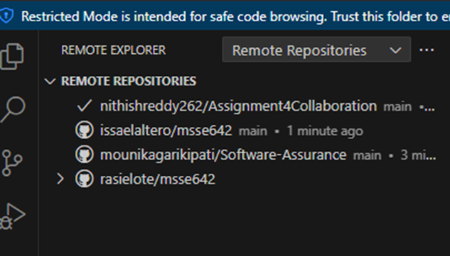

# ACTIVITY 1: Configure Visual Studio Code (VSC)

## Navigated to Local repo 

## Installed Extensions
### Excalidraw

### Git History

### Python

# ACTIVITY 2: Clone the class repo and add to your VSC Workspace

## Student Repo

## Class Repo

